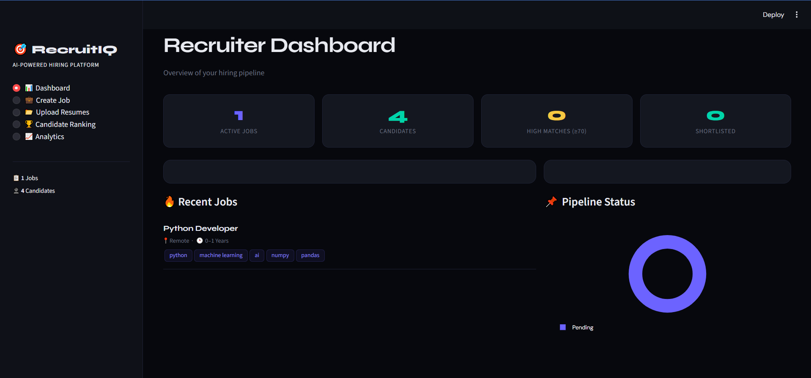
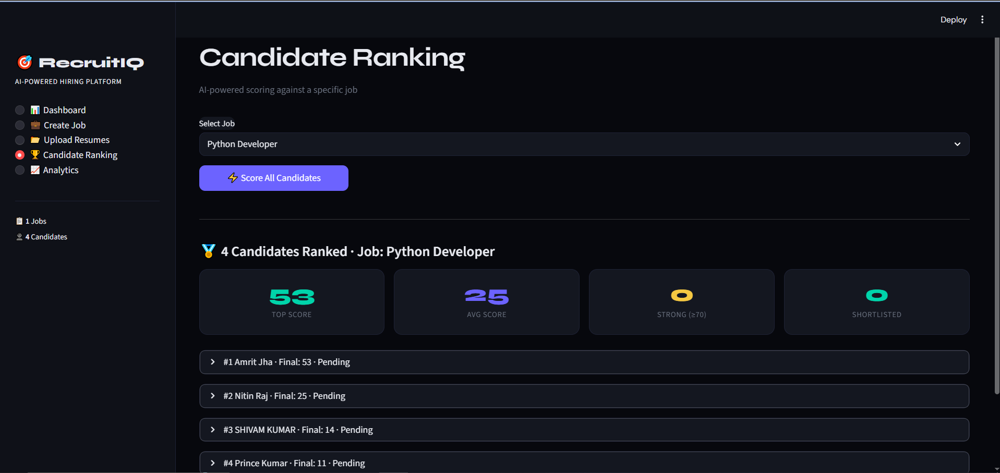
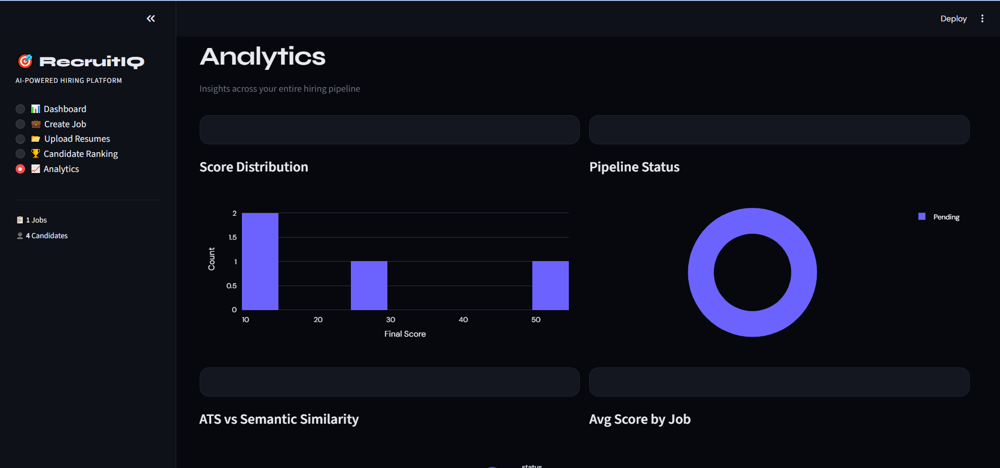
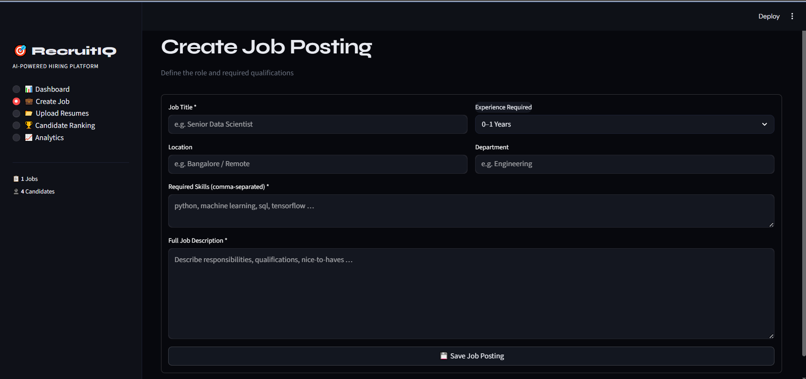
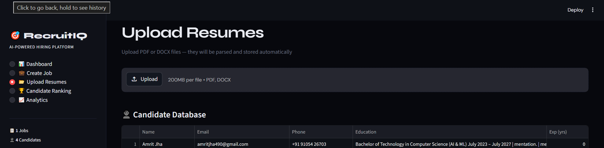

# 🚀 AI Recruiter – Intelligent Hiring Automation System

AI-powered recruitment platform that automates resume parsing, candidate scoring, and ranking using NLP, fuzzy matching, and semantic similarity. Features ATS scoring, skill gap analysis, and interactive dashboards to streamline hiring and improve decision-making.

---

## ✨ Features

- 📄 Resume Parsing (PDF/DOCX)
- 🎯 ATS Score Calculation
- 🧠 AI-Based Candidate Ranking
- 📊 Interactive Analytics Dashboard
- 🔍 Skill Gap Analysis
- ⚡ Semantic Similarity Matching
- 💼 Job Role Management

---

## 🛠️ Tech Stack

- Python
- Streamlit
- Pandas
- Plotly
- RapidFuzz
- Sentence Transformers
- SQLite

---

## 📸 Project Preview

### 🏠 Dashboard


---

### 📊 Candidate Ranking


---

### 📈 Analytics


---

### 💼 Create Job


---

### 📤 Upload Resume


---

## ⚙️ Installation

```bash
git clone https://github.com/Amritjh/AI-Recruiter.git
cd AI-Recruiter
pip install -r requirements.txt
streamlit run app.py
```

---

## 📌 Future Improvements

- Recruiter Authentication System
- Email Automation
- AI Interview Analysis
- Resume Recommendation Engine
- Cloud Database Integration

---

## 👨‍💻 Author

Amrit Jha
